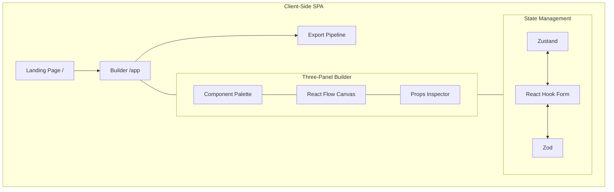
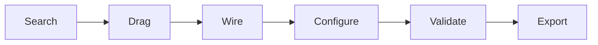

# Shadcn Canvas

Visual builder for [shadcn/ui](https://ui.shadcn.com/) components. Drag components onto an infinite canvas, wire behavior, validate with Zod, and export production-ready React code. Fully client-side.

**Live Demo**: [shadcncanvas.vercel.app](https://shadcncanvas.vercel.app) | **Repository**: [RITIK-KHARYA/shadcncanvas](https://github.com/RITIK-KHARYA/shadcncanvas)

---

## Features

- **Infinite Canvas** - Pan/zoom canvas powered by React Flow
- **54+ Components** - Full shadcn/ui library: Layout, Form, Feedback, Navigation, Data, and more
- **Live Component Rendering** - Real-time preview of components on canvas
- **Node Wiring** - Connect components via typed edges for state flow and event routing
- **Prop Inspector** - Edit component props in real-time with live updates
- **Validation** - Zod schema integration with react-hook-form
- **Code Generation** - Export production-ready JSX directly from canvas
- **ZIP Export** - Download complete project scaffolding with all components and theme data
- **Theme Customization** - Dark mode with OKLCH color tokens, live theme editor
- **History Management** - Undo/redo functionality for all canvas operations
- **Drag & Drop** - Intuitive palette-to-canvas component placement
- **Persistence** - Auto-save projects to browser localStorage
- **Collaborative Ready** - Architecture supports real-time collaboration

---

## Architecture



## Builder Workflow



1. **Search** - Find components in the palette using keywords
2. **Drag** - Place components onto canvas as React Flow nodes
3. **Wire** - Connect nodes via typed edges to define logic flow
4. **Configure** - Edit component props in the inspector panel
5. **Validate** - Run Zod schemas for data validation
6. **Export** - Copy JSX or download complete ZIP package

---

## Tech Stack

| Layer | Technology |
|---|---|
| **Framework** | React 19, TypeScript, Vite |
| **Canvas Engine** | @xyflow/react (React Flow) |
| **UI Components** | shadcn/ui, Radix UI, Base UI |
| **Styling** | Tailwind CSS 4, OKLCH tokens |
| **State Management** | Zustand |
| **Forms** | React Hook Form, Zod |
| **Export/Build** | JSZip, FileSaver, Codegen |
| **Routing** | React Router DOM v7 |
| **Drag & Drop** | React Flow built-in |
| **Icons** | Lucide React |
| **Animations** | Framer Motion |
| **Analytics** | Vercel Analytics |

---

## Code Generation

Export production-ready React JSX directly from your canvas. The codegen engine:

- Maps 50+ shadcn/ui component types to JSX
- Preserves component props, states, and wired event connections
- Generates properly formatted, importable code
- Exports project as ZIP with component graph, theme tokens, and scaffolding

**Export formats:**
- Single JSX file (copy to clipboard)
- Complete project ZIP with multiple files
- TypeScript support
- Theme configuration included

---

## Project Structure

```
src/
  components/ui/         # 54+ shadcn/ui components (Radix UI based)
  pages/                 # Landing and builder pages
    landing-page.tsx
    builder-page.tsx
  hooks/                 # Utility hooks (useIsMobile, etc.)
  lib/                   # Utilities (cn, classname merge, etc.)
  store/                 # Zustand state management
  utils/                 # Codegen, validation, helpers
  App.tsx                # React Router setup
  main.tsx               # Entry point
  global.css             # Global styles + OKLCH tokens
  loaders.css            # Canvas background patterns
```

---

## Quick Start

### Prerequisites
- Node.js 18+ or Bun
- Git

### Installation

```bash
git clone https://github.com/RITIK-KHARYA/shadcncanvas.git
cd shadcncanvas
bun install  # or npm install / yarn install
bun run dev  # or npm run dev
```

Runs at `http://localhost:5173`

### Available Commands

| Command | Purpose |
|---|---|
| `bun run dev` | Start dev server with HMR |
| `bun run build` | Type-check + production build |
| `bun run preview` | Preview production build locally |
| `bun run lint` | Run Oxlint |
| `bun run typecheck` | TypeScript type checking |

**Using Makefile:**
```bash
make dev       # Start dev server
make build     # Production build
make lint      # Run linter
make typecheck # Type check
```

### Adding New Components

Use the shadcn CLI to add new components:

```bash
bunx shadcn-ui@latest add <component-name>
```

Components follow shadcn/ui conventions with Tailwind CSS styling.

---

## Roadmap

### Completed
- [x] Live component rendering on canvas
- [x] Typed edge wiring
- [x] Drag-and-drop palette to canvas
- [x] Inspector prop binding
- [x] Theme customizer
- [x] JSX code generation
- [x] ZIP export with scaffolding
- [x] Undo/redo state machine
- [x] Canvas persistence

### In Progress / Planned
- [ ] Collaborative editing (real-time sync)
- [ ] AI component suggestions
- [ ] Component marketplace
- [ ] Mobile builder preview
- [ ] Component versioning
- [ ] Team workspaces
- [ ] Template library
- [ ] Performance optimizations

---

## Contributing

Contributions are welcome! Here's how to get started:

1. **Fork** the repository
2. **Create** a feature branch: `git checkout -b feature/your-feature`
3. **Commit** your changes: `git commit -m "Add your feature"`
4. **Push** to your fork: `git push origin feature/your-feature`
5. **Open** a Pull Request

### Guidelines
- Use **TypeScript** for all code
- Use **shadcn CLI** for adding new components
- Follow **OKLCH token conventions** for colors
- Ensure code passes `bun run lint`
- Add tests for new features when applicable

---

## License

MIT License - see [LICENSE](./LICENSE) file for details.

---

## Author

Built and maintained by **[Ritik Kharya](https://github.com/RITIK-KHARYA)**

**Connect:**
- GitHub: [@RITIK-KHARYA](https://github.com/RITIK-KHARYA)
- Website: [shadcncanvas.vercel.app](https://shadcncanvas.vercel.app)

---

## Changelog

See [CHANGELOG.md](./CHANGELOG.md) for detailed version history and updates.

---

**Star this repo if you find it helpful!**
