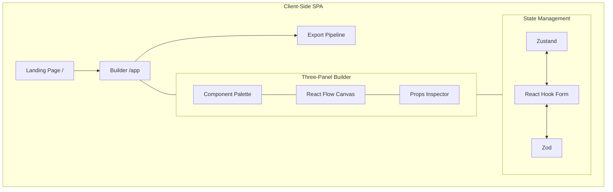
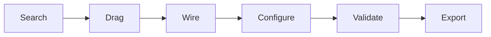

# Shadcn Canvas

Visual builder for [shadcn/ui](https://ui.shadcn.com/) components. Drag components onto an infinite canvas, wire behavior, validate with Zod, export production-ready React code. Fully client-side.

[Repository](https://github.com/RITIK-KHARYA/shadcncanvas) | Live Demo (coming soon)

---

## Features

- Infinite pan/zoom canvas via React Flow
- 54+ shadcn/ui components (Layout, Form, Feedback, Navigation, and more)
- Node wiring for state flow and event routing via typed edges
- Zod schema validation with react-hook-form
- JSX code generation and ZIP export
- Live props inspector with theme token editing
- Dark mode with OKLCH color tokens
- Undo/redo history
- Drag-and-drop palette to canvas
- Local project persistence (localStorage)

---

## Architecture



## Builder Flow



1. **Search** -- find components in the palette
2. **Drag** -- place onto canvas as React Flow nodes
3. **Wire** -- connect nodes via typed edges
4. **Configure** -- edit props in the inspector
5. **Validate** -- run Zod schemas
6. **Export** -- copy JSX or download ZIP

---

## Tech Stack

| Layer | Technology |
|---|---|
| Framework | React 19, TypeScript, Vite |
| Canvas | @xyflow/react |
| Components | shadcn/ui, Radix UI |
| Styling | Tailwind CSS 4, OKLCH tokens |
| State | Zustand |
| Forms | React Hook Form, Zod |
| Export | JSZip, FileSaver, codegen |
| Routing | React Router DOM |
| DnD | React Flow built-in |

---

## Code Generation

Generate production-ready React JSX from your canvas layout. The code generator:

- Maps 30+ shadcn/ui component types to JSX
- Handles props, states, and wired event connections
- Outputs formatted code with proper imports
- Supports ZIP export with graph and theme data

See the [Export](/docs/export) section for usage details.

---

## Structure

```
src/
  components/ui/   -- 54+ shadcn/ui components
  hooks/           -- useIsMobile
  lib/             -- cn() utility
  pages/
    landing-page.tsx
    builder-page.tsx
  App.tsx          -- Routes
  main.tsx         -- Entry
  global.css       -- Theme tokens
  loaders.css      -- Canvas background
```

---

## Setup

```bash
git clone https://github.com/RITIK-KHARYA/shadcncanvas.git
cd shadcncanvas
bun install
bun run dev
```

Runs at `http://localhost:5173`

| Command | What it does |
|---|---|
| `bun run dev` | Dev server with HMR |
| `bun run build` | Type-check + production build |
| `bun run preview` | Preview production build |
| `bun run lint` | Oxlint |

Alternatively, use the Makefile: `make dev`, `make build`, `make lint`, etc.

Add new components:

```bash
bunx shadcn@latest add <component-name>
```

---

## Roadmap

- [ ] Live component rendering on canvas
- [ ] Typed edge wiring
- [ ] Drag-and-drop palette to canvas
- [ ] Inspector prop binding
- [ ] Theme customizer
- [ ] JSX code generation
- [ ] ZIP export with scaffolding
- [ ] Undo/redo state machine
- [ ] Canvas persistence
- [ ] Collaborative editing
- [ ] AI component suggestions

---

## Contributing

1. Fork the repo
2. `git checkout -b feature/your-feature`
3. Commit and push
4. Open a PR

Use TypeScript. Use shadcn CLI for components. Follow OKLCH token conventions.

---

License: MIT

Built by [Ritik Kharya](https://github.com/RITIK-KHARYA)
