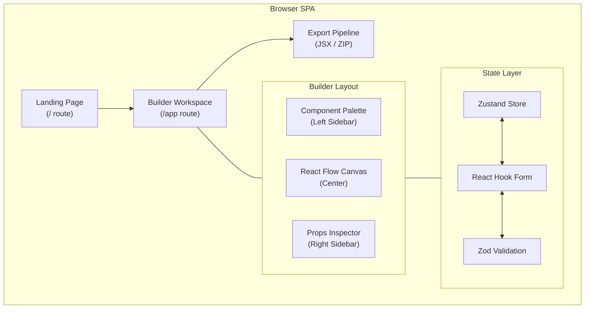
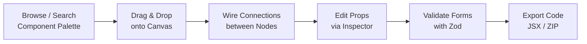

# Shadcn Canvas

A visual builder for [shadcn/ui](https://ui.shadcn.com/) components. Drag real UI primitives onto an infinite canvas, wire behavior between nodes, validate with Zod, and export production-ready React code — all client-side, no backend required.

> Design with real components. Export real code.

| | Link |
|---|---|
| Repository | [github.com/RITIK-KHARYA/shadcncanvas](https://github.com/RITIK-KHARYA/shadcncanvas) |
| Live Demo | _Coming Soon_ |

---

## Features

- **Infinite Canvas** — Pan, zoom, and compose layouts on a React Flow workspace
- **33+ Components** — Curated shadcn/ui library across Layout, Form, Feedback, and Navigation categories
- **Logic Wiring** — Connect nodes to model state flow and event routing
- **Zod Validation** — Schema-first form validation via `react-hook-form` + Zod resolvers
- **Code Export** — Copy JSX to clipboard or download as ZIP
- **Live Inspector** — Edit props, variants, and theme tokens in real time
- **Dark Mode** — OKLCH color tokens with view-transition animations
- **Undo / Redo** — Non-destructive editing history

---

## Architecture



---

## Builder Pipeline



| Step | Action | Detail |
|---:|---|---|
| 1 | **Select** | Search or browse 33+ categorized components |
| 2 | **Place** | Drag from palette to React Flow canvas |
| 3 | **Wire** | Connect nodes via typed edges |
| 4 | **Configure** | Edit variant, size, placeholder, disabled state |
| 5 | **Validate** | Run Zod schemas through react-hook-form resolvers |
| 6 | **Export** | Copy JSX or download ZIP archive |

---

## Tech Stack

| Layer | Technology |
|---|---|
| Framework | React 19, TypeScript 7, Vite 8 |
| Canvas | @xyflow/react |
| Components | shadcn/ui (New York), Radix UI, Base UI |
| Styling | Tailwind CSS 4, OKLCH tokens |
| State | Zustand 5 |
| Forms | React Hook Form 7, Zod 4 |
| Export | JSZip, FileSaver |
| Routing | React Router DOM 7 |
| Icons | Lucide React |
| Lint | Oxlint |

---

## Project Structure

```
shadcncanvas/
├── src/
│   ├── components/ui/     # 33 shadcn/ui components
│   ├── hooks/             # useIsMobile, custom hooks
│   ├── lib/               # Utilities (cn helper)
│   ├── pages/
│   │   ├── landing-page.tsx
│   │   └── builder-page.tsx
│   ├── App.tsx            # Route definitions
│   ├── main.tsx           # Entry point
│   ├── global.css         # Theme tokens, animations
│   └── loaders.css        # Canvas dot-grid background
├── index.html
├── components.json        # shadcn/ui CLI config
├── package.json
├── vite.config.ts
└── tsconfig*.json
```

---

## Quick Start

```bash
git clone https://github.com/RITIK-KHARYA/shadcncanvas.git
cd shadcncanvas
npm install
npm run dev
```

Open **http://localhost:5173**

### Scripts

| Command | Description |
|---|---|
| `npm run dev` | Start dev server with HMR |
| `npm run build` | Type-check and production build |
| `npm run preview` | Preview production build |
| `npm run lint` | Run Oxlint |

### Adding Components

```bash
npx shadcn@latest add <component-name>
```

---

## Roadmap

- [ ] Live component rendering on canvas nodes
- [ ] Typed edge wiring for data/event flow
- [ ] Full drag-and-drop palette-to-canvas pipeline
- [ ] Inspector-to-node prop binding
- [ ] Interactive theme customizer
- [ ] JSX code generation engine
- [ ] ZIP export with project scaffolding
- [ ] Undo/redo via Zustand temporal middleware
- [ ] Canvas persistence (localStorage / IndexedDB)
- [ ] Collaborative editing (WebSocket / CRDT)
- [ ] AI-powered component suggestions

---

## Contributing

1. Fork the repository
2. Create a feature branch — `git checkout -b feature/your-feature`
3. Commit changes — `git commit -m 'Add your feature'`
4. Push — `git push origin feature/your-feature`
5. Open a Pull Request

**Guidelines**: TypeScript only, use shadcn CLI for new components, follow New York style, use OKLCH tokens via CSS variables, include `aria-label` on interactive elements.

---

## License

MIT — see [LICENSE](LICENSE) for details.

<p align="center">
  Built by <a href="https://github.com/RITIK-KHARYA">Ritik Kharya</a>
</p>
